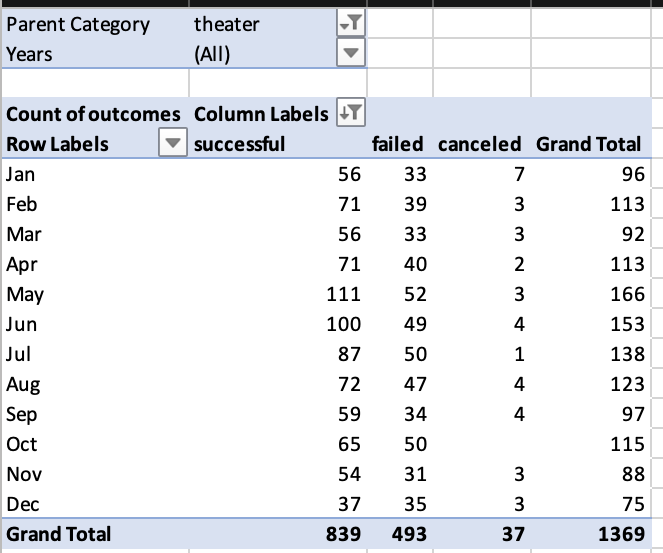

# kickstarter-analysis
Module 1 submission: Kickstarter data and analysis. 
# Kickstarting with Excel

## Overview of Project

### Purpose
The goal with this project was to give Louise data analysis and strategy to support meeting the fundraising goal for her play, Fever. I pulled data from 4,113 Kickstarter projects between the years 2009 and 2018 to find trends to set her crowdfunding campaign up for success. I honed in on two major pieces of analysis: how launch dates and fundraising goals. This way, Louise can choose a launch date and fundraising goal that will maximize her outcomes and lead her to success on Fever and beyond. 

## Analysis and Challenges

### Analysis of Outcomes Based on Launch Date
First, I created a pivot table comparing launch dates in terms of months and outcomes (successful, failed, canceled). To create the pivot table, I first used the YEAR function to add a column of years when the campaign was lauched. 

I set the pivot table filters to include Parent Category and Years. This way, I could find trends specific to theater and compare campaign trends from year to year. My table had outcomes in the columns and launch month in the rows. I grouped the data in terms of months on the table to do so. Furthermore, I left out campaigns that are currently live to focus on completed outcomes. Since Louise' project is a play, it was important to focus on Kickstar campaigns for theater. See the complete pivot table below: 
  

I then created a line chart based on the pivot table to visualize the trends in outcomes based on  launch date. See the line chart below: ---![Theater_Outcomes_vs_Launch(Theater_Outcomes_vs_Launch.png)  

### Analysis of Outcomes Based on Goals
When looking at outcomes based on campaign goals, I created a table that grouped campaign goals in buckets of $5000 and compared them to campaign outcomes of Successful, Failed, and Canceled. Once again, I did not include Live projects because the focus is on completed outcomes only. 
---Then I used the COUNTIFS function to find the number of successful, failed, and canceled campaigns for plays based on each $5000 bucket. I then found and added the percentage of each outcome from the total campaigns to the table as well. See the data in tabular form below:   

From there, I used a line chart to visualize the percentage of each outcome based on the campaign goals to find and understand trends. See the line chart below:   !Outcomes_vs_Goals](Outcomes_vs_Goals.png)  

### Challenges and Difficulties Encountered
It took some time for me to figure out how to group data properly in the Pivot table to ensure that data is shown in terms of months and not years. This way, Louise could actually make a decision on what time of the year would be ideal to launch a Kickstarter campaign. I also struggled with the COUNTIFS function because there were 3-4 arguments to keep up with and they often changed based on the buckets of campaign goals.

## Results

What are two conclusions you can draw about the Outcomes based on Launch Date?
When looking at the launch dates of theater campaigns in the past 8 years overall, there's a strong trend upwards in successful campaigns between the months of March and May. The number of successful campaigns rose from 56 launched in March to 111 in May. Then, starting in June, the number of successful campaigns trend downwards until the end of the year. After May's record high of 111 successful theater campaigns, campaign launches dropped by an estimated average of 14 successful campaigns per month until the end of the year. There were only 37 successful theater Kickstarter campaigns launched in December. There is a small trend upwards between the early months of January and Febuary but most noticable largest trend starts in the Spring. ---

Secondly, It's important to note that the total number of projects increased between the months of April and August so the number of failed projects also increased during the Spring/Summer months and dropped by the end of the year.  The number of canceled projects is quite low, sitting at 37 out of 1,369 projects, making it hard to find a trend. While launching a campaign between May and June seems most succesful, there is also more competition because the total number of campaigns also increased. 

- What can you conclude about the Outcomes based on Goals?
By looking at the line chart revealing outcomes based on campaign goals of plays, I found that as campaign goals increased, the percentage of successful campaigns dropped and the percententage of failed campaigns increased. There is an exception as failed campaigns shot down and successful campaigns jumped up between the campaign goals of $35,000 and $45,000. It is important to note that there are just 34 campaigns with goals above $35,000 out of a total of just over 1,000 Kickstarter campaigns for plays. 

- What are some limitations of this dataset?
When conducting the Launch Dates analysis, there was limited data points before 2014. It was hard to find trends with just 26 Kickstarter campaigns out of a grand total of 1369 theater campaigns.The data was not distributed evenly throughout the 8 years. While having a large sample of data is crucial, it is also important to know how it is distributed among variables. 

When analyzing the Outcomes Based on Goals, building buckets of data limits the details of the information I can analayze and conclude from. Firstly, having $5000 buckets of campaign goals hides a lot of the story I can tell with the data. It would be harder to detect an outlier within a bucket or understand unique trends if I am limiting 1,055 campaigns to just 12 buckets. Additionally, ending the buckets with $50,000 keeps me from understanding what happens with larger Kickstarter goals. I do not know Louise's general goal so creating more specific and targetted buckets would help me understand the trends in campaigns with more detail. 

Finally, using percetages in the line chart for Outcomes Based on Goals limits my understanding to outcomes as a percentage of total. If the total number of projects in any of the groupings increases or decreases drastically, it will affect the percentages and impact my analysis. 

- What are some other possible tables and/or graphs that we could create?
Outcomes based on Average Donation: I would create a chart to see how the relationship between the average amount of each donation impacts the outcome of the campaign (successful, failed, canceled). This way, Louise can build her short term goals and potential incentives based on the average donation amount that garners the most successful outcome. 

Outcomes based on Campaign duration: I would create a chart to see how the relationship between campaign duration (Date ended-Date Created) impacts the outcome of the campaign. This way, Louise can build her campaign knowing the ideal length of her campaign to meet the highest potention for Fever. 
